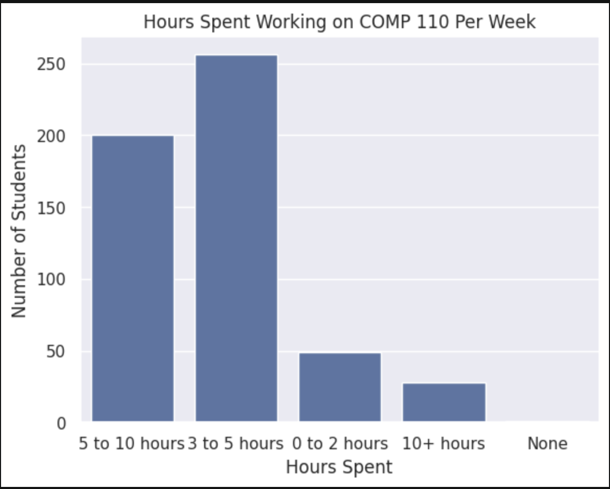
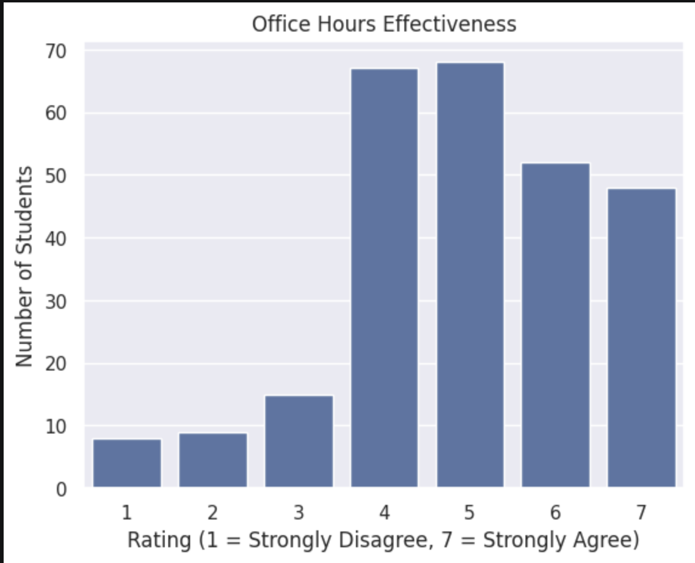
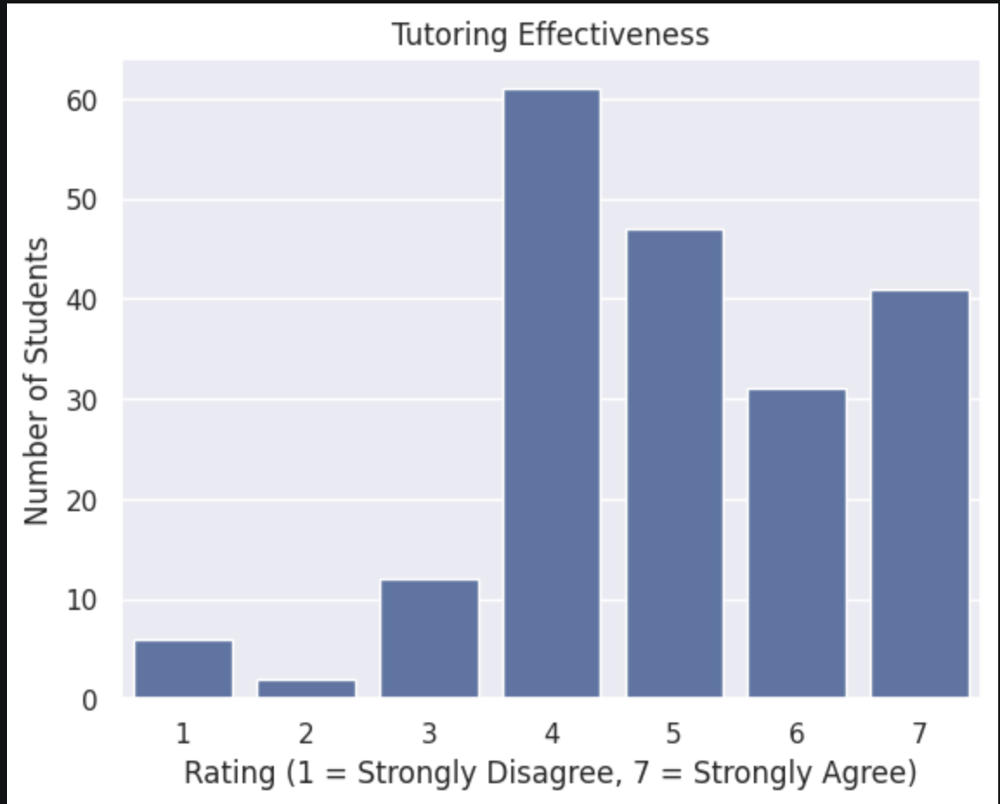

---
# Do not edit the text between these lines!
layout: default
---

# Lucy's EX09 Website!!!

<!-- This is a comment. Below, you'll see code for inserting an image. To make this image appear, update <custom-path>. To add an image, save it inside the imgs folder of this repository. -->

## Conclusions from the Graph

These three charts demonstrate the amount of time that students spend on comp 110 per week, students' ratings of the effectiveness of office hours, and students' ratings of the effectiveness of tutoring. The latter two are measured on a common 1-7 scale, from strongly disagree to strongly agree, with neutral being a score of 4. The results of these ratings demonstrate that sudents generally find office hours and tutoring effective. From this, my recommendation for the course would be to continue to have broad access to these resources and to incentivize tutoring for extra credit after students perform poorly on quizzes. The trade-off for this would be that the TAs would likely have to commit more time to help or the TA team would have to expand. However, since the TAs already commit so much time, potentially including something like a Piazza for questions would be a good compromise. For the first graph, the results show a range of hours that students spend on comp 110 work weekly, which generally is between 3-10 hours. The next step in this process would be cross-analyzing the hours spent per week with the students who use office hours and tutoring to learn about the effect of tutoring and office hours on hours spent per week.